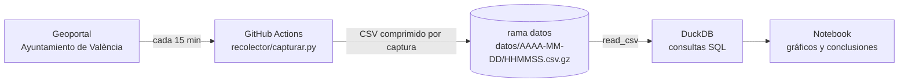

# 🚲 Valenbisi · Análisis para la redistribución de bicis

[](https://github.com/RicardoEdreiraPenas/valenbisi-analisis-redistribucion/actions/workflows/recolectar.yml)
[](https://github.com/RicardoEdreiraPenas/valenbisi-analisis-redistribucion/actions/workflows/tests.yml)


> **Estado: recogiendo datos.** El recolector guarda el estado de las 273 estaciones cada 15 minutos desde el 1 de octubre de 2026. El análisis se publicará cuando haya unas 3 semanas de histórico.

Un sistema de bici compartida tiene un problema operativo diario: por la mañana unas estaciones se vacían y otras se llenan, y hay que mover bicis en furgoneta para equilibrarlas. Este proyecto responde, con datos reales de **Valenbisi** (València), a la pregunta que se haría un responsable de operaciones:

**¿Qué estaciones se quedan vacías o llenas, cuándo ocurre, y cómo organizar la redistribución?**

## Preguntas del análisis

| # | Pregunta | Qué aporta |
| --- | --- | --- |
| 1 | ¿Son fiables los datos? Cobertura por hora y día, huecos y estaciones sin actualizar | Saber qué conclusiones se pueden sacar |
| 2 | ¿Qué estaciones pasan más tiempo vacías (0 bicis) o llenas (0 anclajes libres)? | Ranking de estaciones problemáticas |
| 3 | ¿A qué horas pasa? Laborables frente a fines de semana | Franjas críticas para planificar turnos |
| 4 | ¿Dónde? Zonas que se vacían frente a zonas que se llenan | Mapa de flujos de la ciudad |
| 5 | ¿Cómo redistribuir? Estaciones llenas cerca de estaciones vacías, bicis a mover y rutas necesarias | Recomendación operativa concreta |

Cada pregunta se responde con una consulta SQL (DuckDB) en `sql/`, y los gráficos y conclusiones van en un notebook. Este README será el informe ejecutivo con los hallazgos.

## Cómo se recogen los datos



- Un workflow de **GitHub Actions** ejecuta `recolector/capturar.py` cada 15 minutos, sin servidores propios.
- Cada captura se guarda como un CSV comprimido en la rama [`datos`](https://github.com/RicardoEdreiraPenas/valenbisi-analisis-redistribucion/tree/datos). La rama principal solo contiene el código y el análisis.
- Las horas se guardan en **hora local de València**. También se guarda la última actualización de cada estación según la fuente, para descartar estaciones que no informan.
- GitHub puede retrasar u omitir alguna ejecución programada. Por eso el análisis empieza midiendo la cobertura real.

### Columnas

| Columna | Descripción |
| --- | --- |
| `momento` | Hora local de la captura |
| `estacion_id`, `nombre`, `direccion` | Identificación de la estación |
| `latitud`, `longitud` | Coordenadas (WGS84) |
| `bicis` | Bicis disponibles |
| `anclajes_libres` | Anclajes libres para dejar una bici |
| `capacidad` | Anclajes totales (bicis + libres puede ser menor si hay anclajes averiados) |
| `abierta` | Si la estación está en servicio |
| `actualizado_fuente` | Última actualización de la estación según la fuente |

## Ejecutarlo en local

```bash
pip install -r requirements-dev.txt
python recolector/capturar.py datos   # una captura en datos/
pytest -q
```

## Proyecto relacionado

[valenbisi-data-pipeline](https://github.com/RicardoEdreiraPenas/valenbisi-data-pipeline): pipeline en tiempo real con MongoDB, PostgreSQL, dbt y un mapa interactivo sobre la misma fuente de datos.

## Datos

Fuente: [ValenBisi Disponibilidad](https://opendata.vlci.valencia.es/dataset/valenbisi-disponibilitat-valenbisi-dsiponibilidad), Ajuntament de València, con licencia [CC BY 4.0](https://creativecommons.org/licenses/by/4.0/deed.es). Los datos recogidos en la rama `datos` mantienen esa licencia; el código del repositorio tiene licencia MIT.

## Autor

**Ricardo Edreira Penas** · Data Analyst · Data Engineer Junior
[LinkedIn](https://www.linkedin.com/in/ricardoedreira) · [GitHub](https://github.com/RicardoEdreiraPenas)
